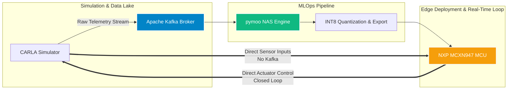

# Autonomous Driving TinyML Pipeline

[](https://www.python.org/)
[](https://pytorch.org/)
[](https://www.tensorflow.org/)
[](https://opensource.org/licenses/MIT)

An end-to-end MLOps and embedded systems framework designed for automated Neural Architecture Search (NAS), hardware-aware INT8 quantization, and real-time event streaming, tailored specifically for deployment on resource-constrained microcontrollers (**NXP MCXN947**).

---

## 🏛️ System Architecture

The pipeline establishes a robust bridge between high-fidelity simulation environments and edge-AI execution targets through an automated, multi-stage workflow:



## ⚙️ Technical Overview & Workflow
This repository contains the code and infrastructure for designing, training, and compiling compact neural network controllers for edge microcontrollers, while maintaining predictable vehicle control accuracy.

The execution pipeline is structured into four core phases:

1. **High-Throughput Telemetry Ingestion (`get-data`):**
   - Captures low-latency vehicle state, sensor feeds, and control metrics from the CARLA Simulator (v0.3.x).
   - Uses an **Apache Kafka** (using KRaft and not Zookeeper) to safely buffer and store big data telemetry, ensuring no data loss between simulation and processing.

2. **Multi-Objective Neural Architecture Search (`train`):**
   - Implements the **NSGA-II** evolutionary algorithm via **pymoo** to search through architectural configurations.
   - Uses **PyTorch** to train and evaluate candidate neural network models during the optimization loop.
   - Simultaneously optimizes competing objectives: minimizing control prediction error (MSE) while strictly bounding memory footprint, parameter count, and inference latency.

3. **Hardware-Aware Quantization & Export:**
   - Applies Post-Training Quantization (PTQ) to convert floating-point PyTorch models into strict **INT8 TensorFlow Lite** representations.
   - Translates the quantized flatbuffers directly into optimized **C-header files (`.h`)** ready for bare-metal flashing on the NXP MCXN947.

4. **Interactive MLOps & HIL Verification:**
   - Features a **NiceGUI**-based web dashboard for pipeline monitoring, training telemetry tracking, and interactive exploration of Pareto-optimal trade-off frontiers.

## 🛠️ System Requirements
* **Python:**: 3.12
* **Containerization:** Docker & Docker Compose (required for Kafka infrastructure)
* **Simulation Environment:** CARLA Simulator (v0.3.19)
> **Note:** Please ensure you use exact versions since CARLA can be notoriously picky about compatibility.

## 🚀 Installation & Setup
Clone the repository to your local environment and initialize a dedicated virtual environment:
```bash
git clone https://github.com/ASkupek/autonomous-tinyml-optimization.git
cd autonomous-tinyml-optimization
pip install --upgrade pip
pip install -r requirements.txt
```

## 💻 Usage Guide
1. **Initialize Streaming Infrastructure**
Spin up the Apache Kafka in the background:
```bash
docker compose up -d
docker exec -it carla-kafka-kraft kafka-topics --create --topic vehicle-telemetry --bootstrap-server localhost:9092 --partitions 3 --replication-factor 1
```

2. **Execute Pipeline via CLI Orchestrator**
The system uses main.py as a centralized entry point for managing execution stages:
``` bash
# Inspect all available CLI commands and configurations
python main.py --help

# Step 1: Ingest and stream CARLA telemetry data (put the mcu_testing flag to False and select number of vehicles)
python main.py --step get-data

# Step 2: Run NSGA-II NAS optimization and model training
python main.py --step train
```

3. **Launch the Monitoring Dashboard**
To inspect training process and get some graphs:
```bash
python dashboard.py
```
Access the control panel locally at: http://localhost:8081 (configured on port 8081 to avoid conflict with Kafka UI).

4. **Run the Test Suite**
Ensure environment and module integrity by executing local unit and integration tests:
```bash
python -m pytest -v
```

## License
Distributed under the MIT License. See LICENSE for more information.
Everything in FRDM-MCXN947_CodeSnippet is based on : SPDX-License-Identifier: BSD-3-Clause
