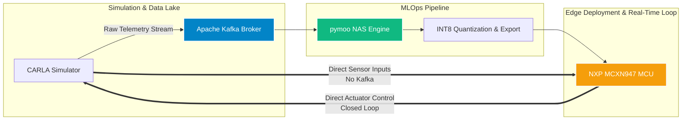
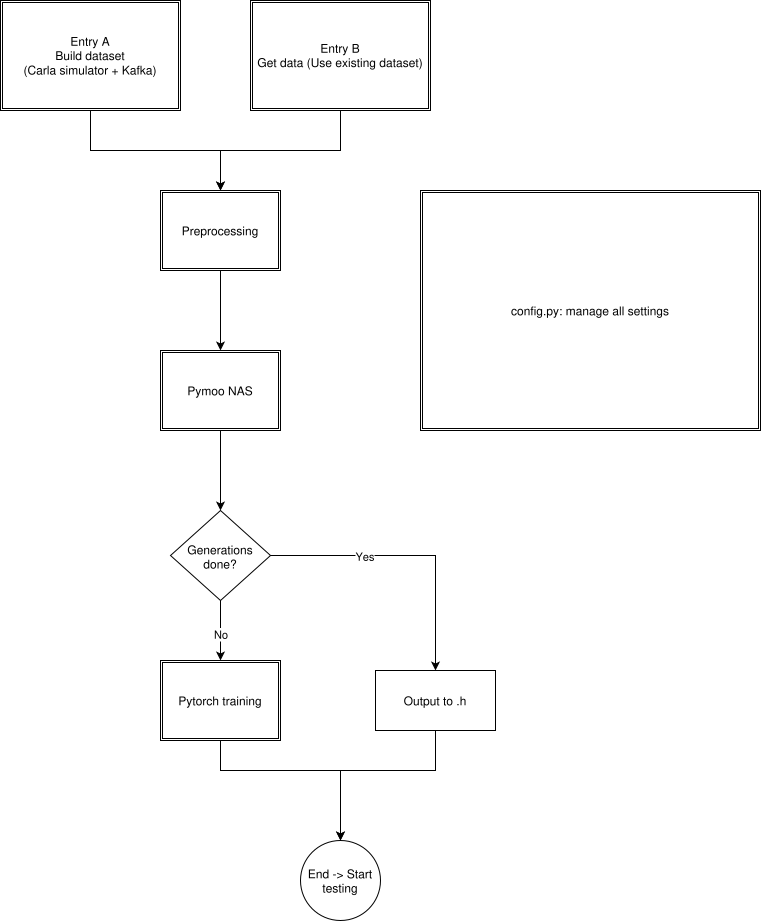
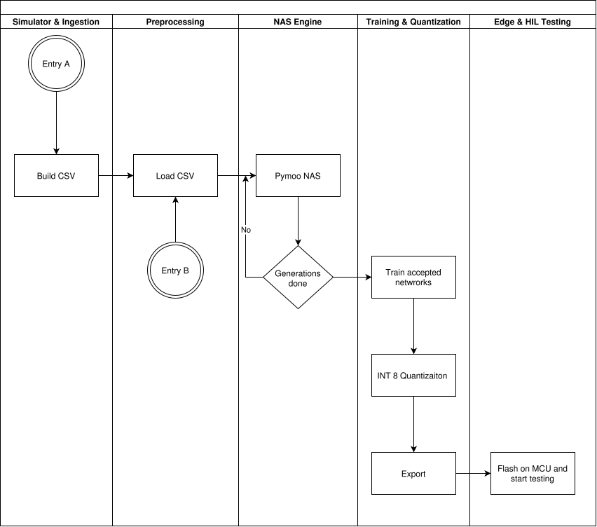
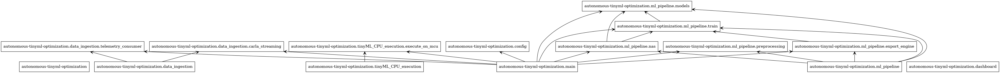
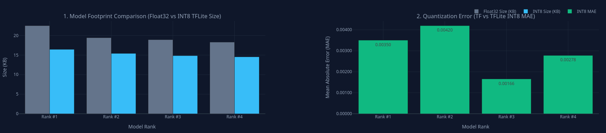
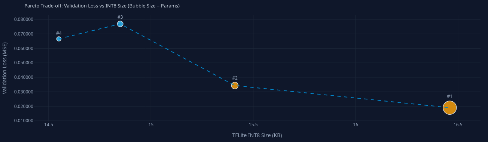
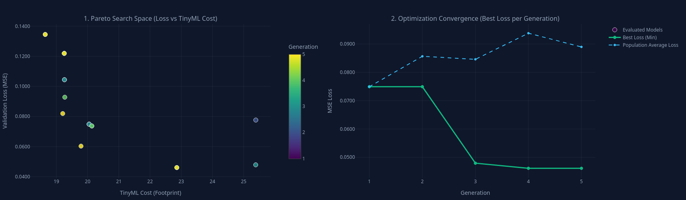

# Version Report: v0.1.0-alpha

## 1. Executive Summary & Status
This report documents the baseline state of the end-to-end Autonomous Driving TinyML pipeline. Version `v0.1.0-alpha` successfully establishes the core multi-stage framework bridging CARLA simulations, Apache Kafka streaming, `pymoo`-driven Neural Architecture Search (NAS), and hardware-aware INT8 quantization targeting the **NXP MCXN947** microcontroller.

---

## 2. System Architecture & Block Diagram
The pipeline clearly separates heavy offline data processing and MLOps from real-time, deterministic on-device execution:

To ensure high flexibility, the pipeline supports dual entry points:
1. **Entry A:** Full end-to-end pipeline starting from the CARLA simulator and Kafka streaming.
2. **Entry B:** Direct usage of an existing CSV dataset, bypassing simulation and ingestion phases.

### High-Level System Architecture

### Process Workflow Diagram

## 3. Software Modularity & Implementation (Code Structure)
To ensure maintainability and clean separation of concerns, the codebase is structured into isolated Python modules:

### Package Dependencies Graph

*(Note: Generated automatically via pyreverse, located in docs/packages.png)*

## 4. Experimental Results & HIL Observations
During the closed-loop Hardware-in-the-Loop (HIL) testing phase on the NXP MCXN947 MCU, the quantized INT8 models successfully executed real-time inference, translating direct sensor inputs from the CARLA simulator into actuator controls (steering and throttle). The vehicle successfully drives and navigates, but eventually encounters collisions in more demanding situations. This indicates that the core system is operational, though it still crashes and requires targeted neural network fine-tuning.
### Training & Closed-Loop Performance
- **NAS Optimization:** The NSGA-II genetic algorithm successfully navigated the search space to find the optimal trade-off: **seeking a model that is both highly accurate ("good model") and lightweight enough ("small model")** to meet the strict memory constraints of the MCU.
- HIL Behavior: While the end-to-end pipeline executes deterministically and the model successfully generates steering commands in real-time, qualitative evaluations show that the vehicle actually drives well and successfully handles standard driving scenarios. However, it still experiences collisions (crashes). This indicates that the current baseline model is fully functional and operational, but might only require targeted fine-tuning, reward function refinement, and minor data distribution adjustments in future iterations.

## NiceGUI Dashboards & Metrics
1. ### Model Footprint & Quantization Error
The charts below compare the size reduction from Float32 to INT8 TFLite across top-ranked candidate models, alongside their respective Mean Absolute Error (MAE) introduced by quantization:

2. ### Pareto Trade-off (Validation Loss vs. INT8 Size)
This Pareto front details the balance between model accuracy (Validation Loss MSE) and memory footprint on the microcontroller, where bubble size corresponds to the total number of parameters:

3. ### NAS Search Space & Optimization Convergence
The left plot illustrates the multi-generational search space showing how models evolve across generations, while the right plot demonstrates the convergence of the genetic algorithm (tracking both the best minimum loss and population average loss over 5 generations):

## 5. Conclusion and Next Steps
The v0.1.0-alpha release successfully establishes the full operational backbone from simulation and automated architecture search to microcontroller deployment.

For the upcoming versions, the primary action items and roadmap include:

- Resolving Code TODOs: Systematically addressing all specific technical TODOs marked across the individual .py class files.

- Documentation Enhancement: Expanding and refining code-level and user-facing documentation.

- Early Stopping Optimization: Implementing automated early stopping mechanisms for training loops once target performance convergence is achieved.

- On-Device Fine-Tuning / Adaptation: Exploring capabilities for fine-tuning or model adaptation directly targeting the MCU environment.

- Collision Mitigation: Refining reward metrics, augmenting training datasets with recovery maneuvers, and optimizing control smoothing to prevent crashes in complex CARLA scenarios.

- Size of .h or tflite model is bigger, so there is a bug looks like in exporting. Need to be checked.